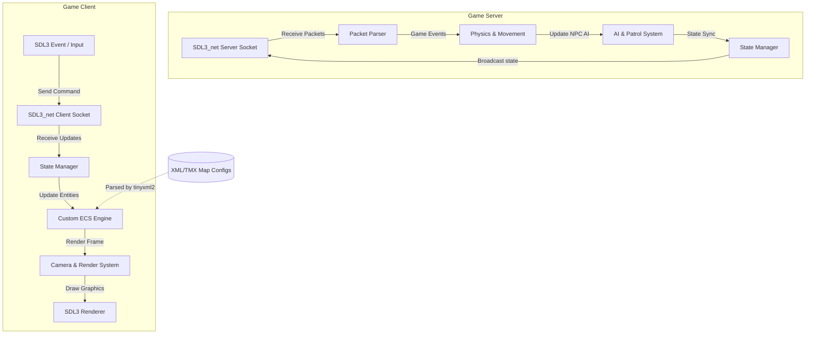

# Ultima Online Remake (OUGame) - C++20 & SDL3 Multiplayer Game Engine


Dự án này là một phiên bản làm lại (remake) của tựa game huyền thoại **Ultima Online**, được xây dựng từ đầu bằng ngôn ngữ **C++20** và thư viện đồ họa **SDL3** mới nhất. Dự án thể hiện khả năng thiết kế kiến trúc game engine, lập trình hệ thống tối ưu hiệu năng, xử lý mạng multiplayer đồng bộ và phát triển đa nền tảng (PC & Android).

---

<details>
<summary>🇬🇧 Click to view English Version</summary>

# Ultima Online Remake (OUGame) - C++20 & SDL3 Multiplayer Game Engine

OUGame is a multiplayer game engine remake of the classic Ultima Online, built from scratch using C++20 and the latest SDL3 (Simple DirectMedia Layer v3). This project showcases system programming capabilities, memory optimization, custom engine architecture (ECS), non-blocking networking, and cross-platform deployment.

</details>

---

## 📐 Kiến Trúc Hệ Thống (System Architecture)

Dưới đây là sơ đồ tương tác giữa các luồng xử lý và dữ liệu của Client và Server:



---

<details>
<summary>🇬🇧 Click to view English Version</summary>

## 📐 System Architecture

Below is the interaction flowchart representing the Client-Server execution loop and network synchronization:

[The Mermaid diagram is displayed above]

</details>

---

## 🚀 Các Tính Năng Nổi Bật (Key Features)

*   **Kiến trúc Client - Server Độc Lập**:
    *   **Server**: Lắng nghe kết nối TCP thông qua `SDL3_net`, duy trì trạng thái thế giới ảo, quản lý quái vật NPC tuần tra và phát đồng bộ trạng thái thực thể tới các client.
    *   **Client**: Tiếp nhận điều khiển từ người chơi, hiển thị đồ họa 2D camera di động và thực hiện nội suy tọa độ giảm thiểu giật lag mạng.
*   **Hệ thống ECS (Entity Component System) tự phát triển**: Quản lý hiệu quả hàng ngàn thực thể (Entities), dữ liệu thành phần (Components) và các hệ thống xử lý logic (Systems), tối ưu hóa CPU Cache Hit.
*   **Quản Lý Tài Nguyên An Toàn**: Thiết kế các lớp `AssetManager` và `TextureManager` tuân thủ nguyên tắc RAII, quản lý vòng đời tài nguyên (Textures, Font TTF) bằng Smart Pointers (`std::unique_ptr`, `std::shared_ptr`), triệt tiêu hoàn toàn lỗi rò rỉ bộ nhớ (Memory Leaks).
*   **Tiled Map Engine**: Tận dụng thư viện `tinyxml2` để phân tích cấu trúc bản đồ dạng lưới 2D từ các tệp cấu hình XML/TMX và render hiệu quả.
*   **Game Loop & FPS Limiter**: Vòng lặp game chuẩn công nghiệp tích hợp bộ giới hạn FPS giúp game chạy mượt mà ổn định ở 60 FPS mà không làm quá tải CPU.
*   **Hỗ trợ Đa Nền tảng**: Hỗ trợ PC (Windows, Linux, macOS) và biên dịch đóng gói trực tiếp cho Android (APK) thông qua Android NDK.

---

<details>
<summary>🇬🇧 Click to view English Version</summary>

## 🚀 Key Features

*   **Decoupled Client-Server Architecture**:
    *   **Server**: Listens for incoming TCP connections via `SDL3_net`, manages world simulations, handles NPC AI patrol logic, and broadcasts entity states to connected clients.
    *   **Client**: Captures player input, renders 2D graphics tracking player movement, and performs coordinate interpolation to resolve network jitter.
*   **Custom Entity Component System (ECS)**: A high-performance custom-built ECS separating entities, data components, and logic systems, maximizing CPU cache locality.
*   **RAII Asset Management**: `AssetManager` and `TextureManager` manage textures and TTF fonts utilizing smart pointers (`std::unique_ptr`, `std::shared_ptr`) to eliminate memory leaks and double-free issues.
*   **Tiled Map Engine**: Parse grid maps from XML/TMX config files dynamically using `tinyxml2`.
*   **FPS Limiter & Game Loop**: Industry-standard game loop limiting frames to 60 FPS to maintain peak rendering performance while minimizing CPU overhead.
*   **Cross-platform Support**: Native builds for Windows, Linux, macOS, and Android builds (APK packaging via Android NDK integrations).

</details>

---

## 📁 Cấu Trúc Thư Mục (Folder Structure)

```text
src/
├── Common/            # Chứa WorldConfig, gói tin mạng dùng chung cho Client/Server
├── ECS/               # Hệ thống ECS tự phát triển (ECS.hpp) và các component nhân vật
├── Core/              # Core logic Game Client, AssetManager, Camera di chuyển
├── World/             # Quản lý bản đồ game, tải dữ liệu map từ XML qua tinyxml2
├── Server/            # Core logic Game Server xử lý Socket, AI quái vật, đồng bộ
└── main.cpp           # Điểm khởi chạy của Game Client
```

---

<details>
<summary>🇬🇧 Click to view English Version</summary>

## 📁 Folder Structure

```text
src/
├── Common/            # Shared config (WorldConfig), packet definitions
├── ECS/               # Custom ECS core (ECS.hpp) and standard component types
├── Core/              # Client runtime core, camera positioning, asset loading
├── World/             # Map engine parsing and grid tiles visualization
├── Server/            # Server executable entry, non-blocking socket loops, NPC AI
└── main.cpp           # Game Client main entrypoint
```

</details>

---

## 🛠️ Công Nghệ & Thư Viện Sử Dụng (Tech Stack)

*   **Ngôn ngữ**: C++20 (Smart pointers, STL, constexpr)
*   **Build System**: CMake (>= 3.22) sử dụng `FetchContent` để tự động tải các dependencies
*   **Thư viện đồ họa**: SDL3 (Simple DirectMedia Layer v3.2.0)
*   **UI & Fonts**: SDL3_ttf & SDL3_image
*   **Mạng**: SDL3_net (TCP Sockets phi chặn)
*   **XML Parser**: tinyxml2
*   **Hệ điều hành mục tiêu**: Windows, Linux, macOS, Android

---

<details>
<summary>🇬🇧 Click to view English Version</summary>

## 🛠️ Tech Stack

*   **Language**: C++20 (Smart pointers, STL features, constexpr constructs)
*   **Build System**: CMake (>= 3.22) with `FetchContent` configuration for zero-setup builds
*   **Graphics Library**: SDL3 (v3.2.0)
*   **UI & Fonts**: SDL3_ttf & SDL3_image
*   **Networking**: SDL3_net (Non-blocking TCP socket implementation)
*   **XML Parser**: tinyxml2
*   **Target Platforms**: Windows, Linux, macOS, Android

</details>

---

## 💻 Hướng Dẫn Cài Đặt & Biên Dịch (Build Guide)

### Yêu Cầu Hệ Thống (Prerequisites)
*   Cài đặt CMake phiên bản 3.22 trở lên.
*   Trình biên dịch C++20 (MSVC trên Windows, GCC hoặc Clang trên Linux/macOS).
*   Thư viện `ZLIB` đã được cấu hình trên hệ thống.

### Biên dịch trên PC (Windows / Linux / macOS)
1.  Tạo thư mục build và cấu hình dự án bằng CMake:
    ```bash
    mkdir build
    cd build
    cmake ..
    ```
    *(Hệ thống sẽ tự động fetch SDL3, SDL3_image, SDL3_ttf, SDL3_net và tinyxml2 từ GitHub)*
2.  Biên dịch dự án:
    ```bash
    cmake --build . --config Release
    ```
3.  Chạy ứng dụng:
    *   Chạy Server: `./bin/OUGameServer` (hoặc `OUGameServer.exe`)
    *   Chạy Client: `./bin/OUGameClient` (hoặc `OUGameClient.exe`)

---

<details>
<summary>🇬🇧 Click to view English Version</summary>

## 💻 Build Guide

### Prerequisites
*   CMake 3.22 or higher installed.
*   C++20 compliant compiler (MSVC, GCC, or Clang).
*   `ZLIB` configured on your system.

### Build Steps (PC)
1.  Generate build files via CMake:
    ```bash
    mkdir build
    cd build
    cmake ..
    ```
    *(Dependencies like SDL3, SDL3_image, SDL3_ttf, SDL3_net, and tinyxml2 will be fetched automatically)*
2.  Compile the target:
    ```bash
    cmake --build . --config Release
    ```
3.  Launch binaries:
    *   Launch Server: `./bin/OUGameServer` (or `OUGameServer.exe`)
    *   Launch Client: `./bin/OUGameClient` (or `OUGameClient.exe`)

</details>

---

## 💡 Tư Duy Thiết Kế & Best Practices (Design & Best Practices)

1.  **RAII & Memory Safety**: Tránh sử dụng con trỏ thô (`raw pointers`). Toàn bộ tài nguyên đồ họa và font chữ được bọc trong các lớp quản lý dùng con trỏ thông minh giúp tự động giải phóng bộ nhớ khi ra khỏi phạm vi sử dụng.
2.  **Data-Oriented Design**: Thiết kế ECS giúp phân chia các đối tượng thành các mảng bộ nhớ tuần tự (Contiguous memory allocations), tăng hiệu quả sử dụng bộ đệm CPU (CPU Cache locality) khi lặp qua hàng loạt Entity.
3.  **Non-blocking Network**: Xử lý logic mạng của Server chạy trên Socket phi chặn (Non-blocking), đảm bảo không xảy ra hiện tượng đứng màn hình ở Client khi mất kết nối đột ngột.

---

<details>
<summary>🇬🇧 Click to view English Version</summary>

## 💡 Design & Best Practices

1.  **RAII & Smart Memory**: Raw pointers are replaced with custom resource controls wrapped inside smart pointers, avoiding memory leaks and double-free exceptions.
2.  **Data-Oriented ECS**: Structuring components in contiguous memory arrays optimizes sequential updates, increasing CPU cache hit ratios significantly.
3.  **Non-blocking Sockets**: Non-blocking TCP sockets handle packets asynchronously without pausing the main graphics and update thread.

</details>

---

## 🗺️ Kế Hoạch Phát Triển (Roadmap)
*   [ ] Tối ưu hóa thuật toán tìm đường A* đa luồng cho quái vật NPC.
*   [ ] Chuyển đổi giao thức đồng bộ di chuyển sang UDP/ENet để tối ưu hóa băng thông.
*   [ ] Tích hợp hệ thống âm thanh (SDL3_mixer).
```
